# Hand-Gestures-and-Finger-Counting
A python program to recognize hand gestures and count fingers using OpenCV library. 

Here are some code parts followed by some images representing the code results.

```
if len(contours) > 0:
        # Find the maximum contour each time (on each frame)
        # --Max Contour--
        max_contour = max(contours, key=cv2.contourArea)
        # Draw maximum contour (blue color)
        cv2.drawContours(test_window, max_contour, -1, (255,0,0), 3)
```
<p align="center">
  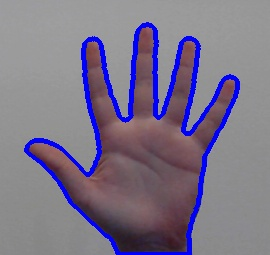
  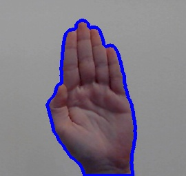
  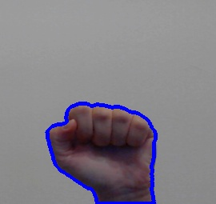
</p>

<p align="center">
  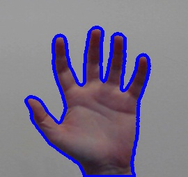
  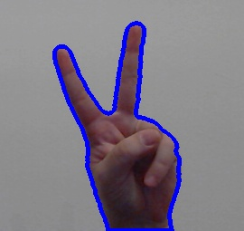
</p>

```
        # Find the convex hull "around" the max_contour
        # --Convex Hull--
        convhull = cv2.convexHull(max_contour, returnPoints = True) 
        # Draw convex hull (red color)
        cv2.drawContours(test_window, [convhull], -1, (0,0,255), 3, 2)
```
<p align="center">
  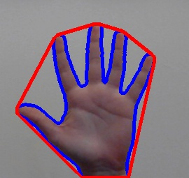
  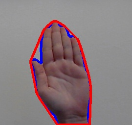
  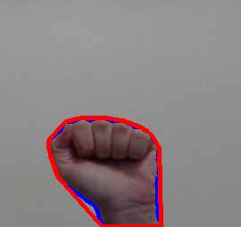
</p>

<p align="center">
  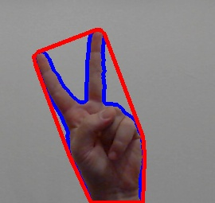
  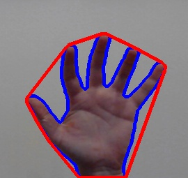
  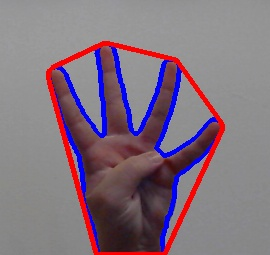
</p>

```
        min_y = frame.shape[0] # Set the minimum y-value to a variable
        final_point = (frame.shape[1], frame.shape[0])
        for i in range(len(convhull)):
            point = (convhull[i][0][0], convhull[i][0][1])
            if point[1] < min_y:
                min_y = point[1]
                final_point = point
        # Draw a circle (black color) to the point with the minimum y-value (height)
        cv2.circle(test_window, final_point, 5, (0,0,0), 2)
```
<p align="center">
  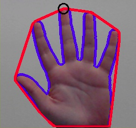
  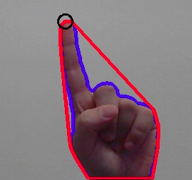
</p>

<p align="center">
  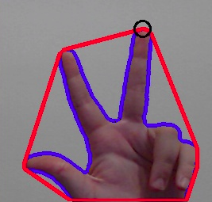
  
</p>

```
         M = cv2.moments(max_contour) # Moments

        # Find the center of the max contour
        if M["m00"]!=0:
            cX = int(M["m10"] / M["m00"])
            cY = int(M["m01"] / M["m00"])
            # Draw circle (red color) in the center of max contour
            cv2.circle(test_window, (cX, cY), 6, (0,0,255), 3) 
```
<p align="center">
  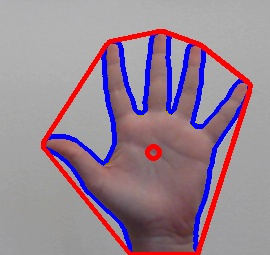
  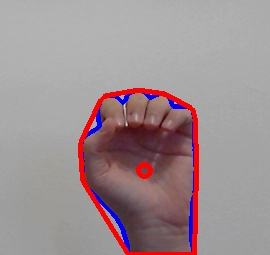
</p>

<p align="center">
  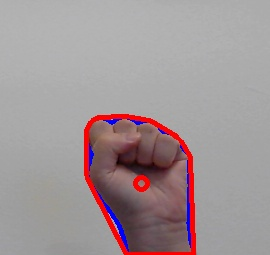
  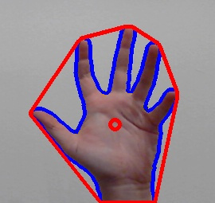
</p>

## Author
* **Konstantinos Thanos**
