# Hand Gestures and Finger Counting 
This is a project made with Python and OpenCV library. 
Below there are some instructions and information about the most significant parts of this project
 
## Preparing the environment
First of all we define a smaller window (*test_window*) inside the main frame window which is our ROI (Region of Interest). Only inside this sub-frame our tests will be visible.

```python
# Points (x1,y1) and (x2, y2)
top_left = (245, 150) 
bottom_right = (580, 395) 
```
<p align="center">

</p>

## Binary mask for the hand
We want to focuse only to user's hand. So in this part we must isolate the hand from the background. 

First of all we must apply Gaussian Blur on the ROI

```python
test_window_blurred = cv2.GaussianBlur(test_window, (5,5), 0)
```

Our window is in RGB format by default. We will convert it to HSV format

```python
# Convert to HSV format
hsv = cv2.cvtColor(test_window_blurred, cv2.COLOR_BGR2HSV)
```
	
In order to find user's skin color (proper values), user can modify the trackbars until the hand is the only thing that is visible. To enable trackbars window we must define it before we start our program. So after the import of the libraries we can add this part of code

```python
def nothing(x):
	pass

cv2.namedWindow("trackbars")
cv2.createTrackbar("L-H", "trackbars", 0, 179, nothing)
cv2.createTrackbar("L-S", "trackbars", 0, 255, nothing)
cv2.createTrackbar("L-V", "trackbars", 0, 255, nothing)
cv2.createTrackbar("U-H", "trackbars", 179, 179, nothing)
cv2.createTrackbar("U-S", "trackbars", 255, 255, nothing)
cv2.createTrackbar("U-V", "trackbars", 255, 255, nothing)
```
	
After that is time to define a range for the colors, based on arrays

```python
# Find finger (skin) color using trackbars
l_h = cv2.getTrackbarPos("L-H", "trackbars")
l_s = cv2.getTrackbarPos("L-S", "trackbars")
l_v = cv2.getTrackbarPos("L-V", "trackbars")
u_h = cv2.getTrackbarPos("U-H", "trackbars")
u_s = cv2.getTrackbarPos("U-S", "trackbars")
u_v = cv2.getTrackbarPos("U-V", "trackbars")

# Create a range for the colors (skin color) 
lower_color = np.array([l_h, l_s, l_v])
upper_color = np.array([u_h, u_s, u_v])
```
    
Finally we will get the following mask

```python
# Create a mask
mask = cv2.inRange(hsv, lower_color, upper_color)
cv2.imshow("Mask", mask) # Show mask frame
```
	
<p align="center">	
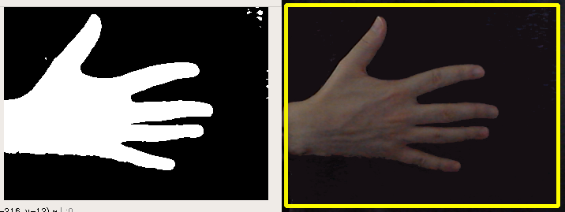
</p>	

## Computing the maximum contour and it's convex hull
For each frame on our capture we are finding the maximum contour inside the ROI.

### Max contour
```python
if len(contours) > 0:
	# Find the maximum contour each time (on each frame)
	# --Max Contour--
	max_contour = max(contours, key=cv2.contourArea)
	# Draw maximum contour (blue color)
	cv2.drawContours(test_window, max_contour, -1, (255,0,0), 3)
```

<p align="center">
  
  
  
</p>

<p align="center">
  
  
</p>

### Convex Hull of max contour

```python
# Find the convex hull "around" the max_contour
# --Convex Hull--
convhull = cv2.convexHull(max_contour, returnPoints = True) 
# Draw convex hull (red color)
cv2.drawContours(test_window, [convhull], -1, (0,0,255), 3, 2)
```
<p align="center">
  
  
  
</p>

<p align="center">
  
  
  
</p>

## Finding the point with the minimum y-value inside the convex hull
This is the *highest* point of the convex hull.

```python
min_y = frame.shape[0] # Set the minimum y-value to a variable
final_point = (frame.shape[1], frame.shape[0])
for i in range(len(convhull)):
    point = (convhull[i][0][0], convhull[i][0][1])
    if point[1] < min_y:
	min_y = point[1]
	final_point = point
# Draw a circle (black color) to the point with the minimum y-value (height)
cv2.circle(test_window, final_point, 5, (0,0,0), 2)
```
<p align="center">
  
  
  
  
</p>

## Finding the center of the max_contour
The center of max contour is defined by the point (cx, cy) using *cv2.momenth()*

```python
 M = cv2.moments(max_contour) # Moments

# Find the center of the max contour
if M["m00"]!=0:
    cX = int(M["m10"] / M["m00"])
    cY = int(M["m01"] / M["m00"])
    # Draw circle (red color) in the center of max contour
    cv2.circle(test_window, (cX, cY), 6, (0,0,255), 3) 
```
<p align="center">
  
  
  
  
</p>

## Calculating the defect points in the hand
First we will find and draw polygon that is defined by the contour

```python
# --Contour Polygon--
contour_poly = cv2.approxPolyDP(max_contour, 0.01*cv2.arcLength(max_contour,True), True)
# Draw contour polygon (white color)
cv2.fillPoly(test_window, [max_contour], (255,255,255)) 
```
<p align="center">
  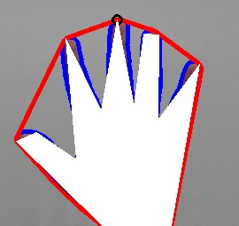
  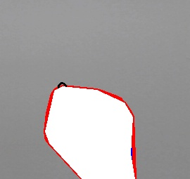
  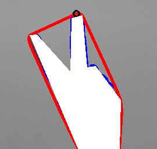
</p>

<p align="center">
  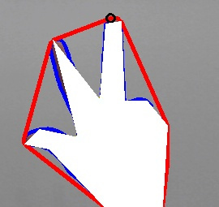
  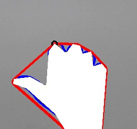
</p>

Then we will find the start and the end points

```python
for i in range(defects.shape[0]): # Len of arrays
    start_index, end_index, far_pt_index, fix_dept = defects[i][0]
    start_pts = tuple(contour_poly[start_index][0])
    end_pts = tuple(contour_poly[end_index][0])
    mid_pts = (int((start_pts[0]+end_pts[0])/2), int((start_pts[1]+end_pts[1])/2))
    #--Start Points-- (yellow color)
    cv2.circle(test_window, start_pts, 2, (0,255,255), 2)
```
<p align="center">
  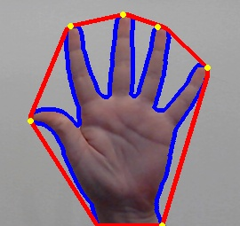
  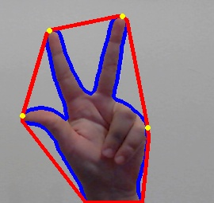
  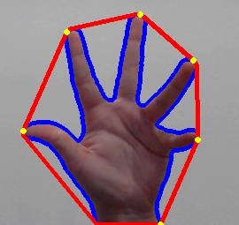
</p>

<p align="center">
  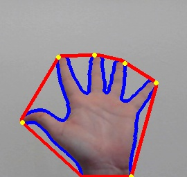
  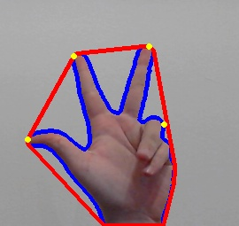
</p>

```python
                    #--End Points-- (black color)
                    cv2.circle(test_window, end_pts, 2, (0,0,0), 2)
```
<p align="center">
  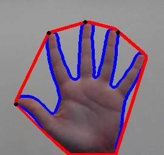
  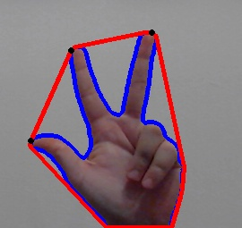
  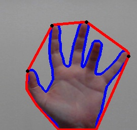
</p>

<p align="center">
  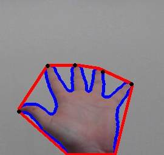
  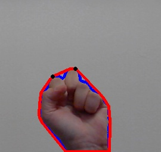
</p>

```
                    #--Far Points-- (white color)
                    cv2.circle(test_window, far_pts, 2, (255,255,255), 2)
```
<p align="center">
  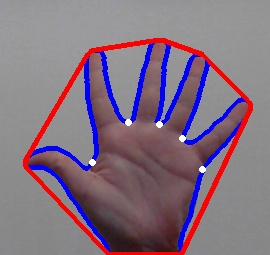
  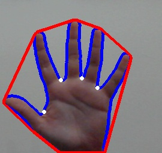
  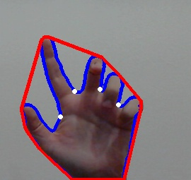
</p>

<p align="center">
  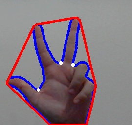
  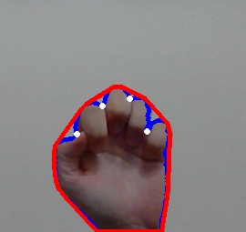
</p>

## Author
* **Konstantinos Thanos**
