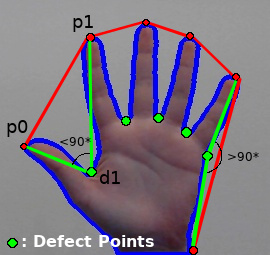

# Hand Gestures and Finger Counting 
This is a project made with Python and OpenCV library. 
Below there are some instructions and information about the most significant parts of this project
 
## Preparing the environment
Define a smaller window (*test_window*) inside the main frame window which is our ROI (Region of Interest). Only inside this window the tests will be visible.

```python
# Define the Region Of Interest (ROI) window 
top_left = (245, 150) 
bottom_right = (580, 395) 
cv2.rectangle(frame, (top_left[0]-5, top_left[1]-5), (bottom_right[0]+5, bottom_right[1]+5), (0,255,255), 3)
```
<p align="center">

</p>

## Create mask for the hand
Focuse only to user's hand. So in this part the hand must be isolated from the background. 

Apply Gaussian Blur on the ROI

```python
test_window_blurred = cv2.GaussianBlur(test_window, (5,5), 0)
```

The window is in BGR format by default. Convert it to HSV format

```python
# Convert ROI only to HSV format
hsv = cv2.cvtColor(test_window_blurred, cv2.COLOR_BGR2HSV)
```
	
In order to find user's skin color (array values), user can modify the trackbars until the hand is the only thing that is visible. To enable trackbars window someone must define it before starting the program. So after the importing the necessary packages add this part of code

```python
def nothing(x):
	pass

cv2.namedWindow("trackbars")
cv2.createTrackbar("Lower-H", "trackbars", 0, 179, nothing)
cv2.createTrackbar("Lower-S", "trackbars", 0, 255, nothing)
cv2.createTrackbar("Lower-V", "trackbars", 0, 255, nothing)
cv2.createTrackbar("Upper-H", "trackbars", 179, 179, nothing)
cv2.createTrackbar("Upper-S", "trackbars", 255, 255, nothing)
cv2.createTrackbar("Upper-V", "trackbars", 255, 255, nothing)
```
	
After that is time to define a range for the colors, based on arrays

```python
# Find finger (skin) color using trackbars
low_h = cv2.getTrackbarPos("Lower-H", "trackbars")
low_s = cv2.getTrackbarPos("Lower-S", "trackbars")
low_v = cv2.getTrackbarPos("Lower-V", "trackbars")
up_h = cv2.getTrackbarPos("Upper-H", "trackbars")
up_s = cv2.getTrackbarPos("Upper-S", "trackbars")
up_v = cv2.getTrackbarPos("Upper-V", "trackbars")

# Create a range for the colors (skin color) 
lower_color = np.array([low_h, low_s, low_v])
upper_color = np.array([up_h, up_s, up_v])
```
    
Finally get the mask

```python
# Create a mask
mask = cv2.inRange(hsv, lower_color, upper_color)
cv2.imshow("Mask", mask) # Show mask frame
```
	
<p align="center">	

</p>	

## Computing the maximum contour and it's convex hull
For each frame on the video capture find the maximum contour inside the ROI.

### Max contour
```python
if len(contours) > 0:
	# Find the maximum contour each time (on each frame)
	# --Max Contour--
	max_contour = max(contours, key=cv2.contourArea)
	# Draw maximum contour (blue color)
	cv2.drawContours(test_window, max_contour, -1, (255,0,0), 3)
```

<p align="center">
  
  
  
</p>

<p align="center">
  
  
</p>

### Convex Hull around max contour

```python
# Find the convex hull "around" the max_contour
# --Convex Hull--
convhull = cv2.convexHull(max_contour, returnPoints = True) 
# Draw convex hull (red color)
cv2.drawContours(test_window, [convhull], -1, (0,0,255), 3, 2)
```
<p align="center">
  
  
  
</p>

<p align="center">
  
  
  
</p>

## Finding the point with the minimum y-value inside the convex hull
This is the *highest* point of the convex hull.

```python
min_y = frame.shape[0] # Set the minimum y-value equal to frame's height value
final_point = (frame.shape[1], frame.shape[0])
for i in range(len(convhull)):
    point = (convhull[i][0][0], convhull[i][0][1])
    if point[1] < min_y:
	min_y = point[1]
	final_point = point
# Draw a circle (black color) to the point with the minimum y-value
cv2.circle(test_window, final_point, 5, (0,0,0), 2)
```
<p align="center">
  
  
  
  
</p>

## Finding the center of the max_contour
The center of max contour is defined by the point (cx, cy) using *cv2.momenth()*

```python
 M = cv2.moments(max_contour) # Moments

# Find the center of the max contour
if M["m00"]!=0:
    cX = int(M["m10"] / M["m00"])
    cY = int(M["m01"] / M["m00"])
    # Draw circle (red color) in the center of max contour
    cv2.circle(test_window, (cX, cY), 6, (0,0,255), 3) 
```
<p align="center">
  
  
  
  
</p>

## Calculating the defect points in the hand
[Contours in OpenCV](https://opencv-python-tutroals.readthedocs.io/en/latest/py_tutorials/py_imgproc/py_contours/py_contours_more_functions/py_contours_more_functions.html)  

Find and draw the polygon that is defined by the contour

```python
# --Contour Polygon--
contour_poly = cv2.approxPolyDP(max_contour, 0.01*cv2.arcLength(max_contour,True), True)
# Draw contour polygon (white color)
cv2.fillPoly(test_window, [max_contour], text_color) 
```
<p align="center">
  
  
  
</p>

<p align="center">
  
  
</p>

The result of the command
```python
defects = cv2.convexityDefects(contour_poly, hull)
```
is array where each row contains the values: 
1. start point
2. end point
3. farthest point 
4. approximate distance to farthest point 

Then find these points plus the mid points on each frame as below

```python
for i in range(defects.shape[0]): # Len of arrays
    start_index, end_index, far_pt_index, fix_dept = defects[i][0]
    start_pts = tuple(contour_poly[start_index][0])
    end_pts = tuple(contour_poly[end_index][0])
    far_pts = tuple(contour_poly[far_pt_index][0])
    mid_pts = (int((start_pts[0]+end_pts[0])/2), int((start_pts[1]+end_pts[1])/2))
    #--Start Points-- (yellow color)
    cv2.circle(test_window, start_pts, 2, (0,255,255), 2)
```
<p align="center">
  
  
  
</p>

<p align="center">
  
  
</p>

```python
#--End Points-- (black color)
cv2.circle(test_window, end_pts, 2, (0,0,0), 2)
```
<p align="center">
  
  
  
</p>

<p align="center">
  
  
</p>

```python
#--Far Points-- (white color)
cv2.circle(test_window, far_pts, 2, text_color, 2)
```
<p align="center">
  
  
  
</p>

<p align="center">
  
  
</p>

## Finger Counting
In order to do the finger counting we should find a way to check how many fingers are displayed. To do this we are calculating the angle between start point, defect point and end point as shown below.
<p align="center">
  
</p>
 
```python
# --Calculate distances--
# If p1 = (x1, y1) and p2 = (x2, y2) the the distance between them is
 # Dist : sqrt[(x2-x1)^2 + (y2-y1)^2]
 
# Distance between the start and the end defect point
a = math.sqrt((end_pts[0] - start_pts[0])**2 + (end_pts[1] - start_pts[1])**2)
# Distance between the farthest (defect) point and the start point
b = math.sqrt((far_pts[0] - start_pts[0])**2 + (far_pts[1] - start_pts[1])**2)
# Distance between the farthest (defect) point and the end point
c = math.sqrt((end_pts[0] - far_pts[0])**2 + (end_pts[1] - far_pts[1])**2)  

angle = math.acos((b**2 + c**2 - a**2) / (2*b*c))  # Find each angle
# If angle > 90 then the farthest point is "outside the area of fingers"
if angle <= 90:  
	count += 1
	frame[0:40, w-40:w] = (0)
```

## Display Finger Counter

```python
for c in range(5):
	if count == c:
		cv2.putText(frame, str(count+1), (w-35,30), font, 2, text_color, 2)
```
## Conclusion
As we can see when running this script we come up with a problem. This problem is that we always have 1 finger displayed in the counter position.


## Author
* **Konstantinos Thanos**
